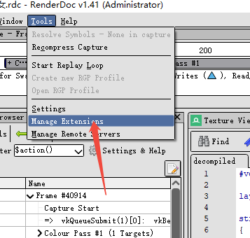
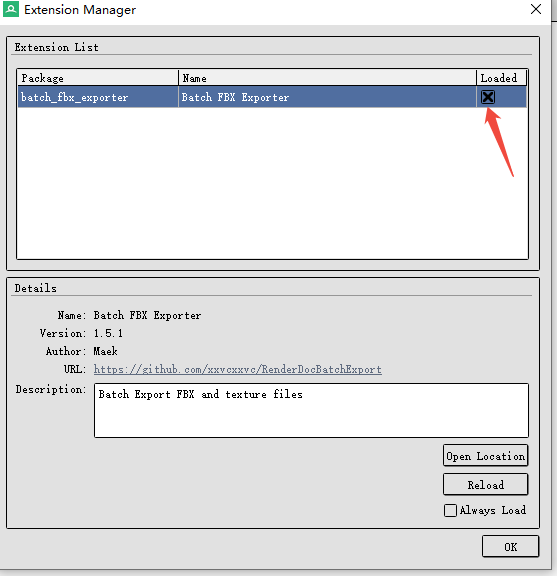
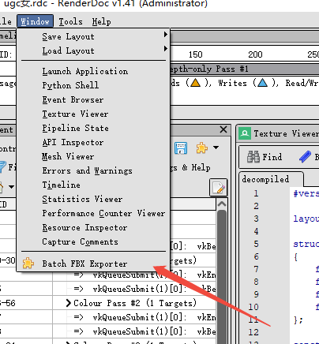
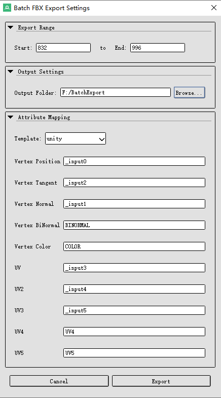
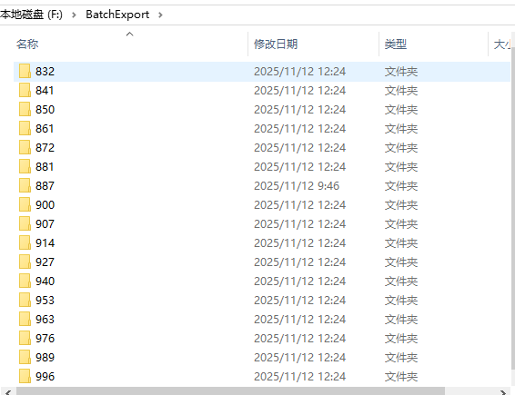
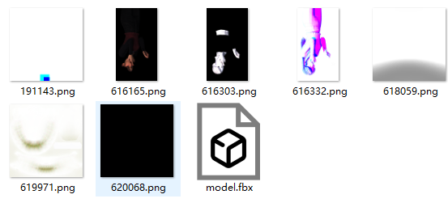

# RenderDocBatchExport
A plugin for RenderDoc that can extract FBX models and texture files based on the index.

run install.bat

用于RenderDoc的插件，能够根据索引导出FBX模型以及贴图文件

运行install.bat进行安装

</img>

</img>

</img>

</img>

</img>

</img>

</img>